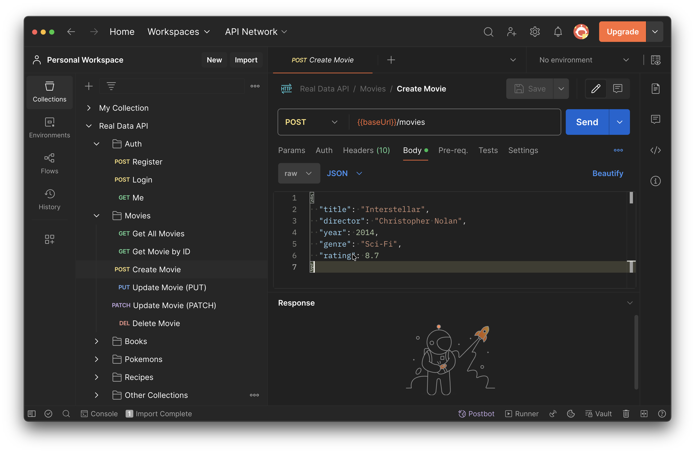

# Real Data API

A REST API serving curated, real-world data sets. No fake data - real films, real musicians, real recipes.

Built with Express. No database needed - just a single `db.json` file.

## Live Demo

Static JSON available at: **https://zaferayan.github.io/real-data-api**

**Test Page:** Browse all endpoints with images at **https://zaferayan.github.io/real-data-api/test.html** or run locally at `http://localhost:4000/test`.

## Installation

```bash
npm install
```

## Usage

```bash
npm start
```

API runs at `http://localhost:4000`.

## Endpoints

| Endpoint | Items | Example |
|----------|-------|---------|
| `/movies` | 10 | The Shawshank Redemption, The Dark Knight, Inception... |
| `/books` | 10 | 1984, The Great Gatsby, The Lord of the Rings... |
| `/artists` | 10 | Leonardo da Vinci, Van Gogh, Frida Kahlo... |
| `/musicians` | 10 | The Beatles, Queen, Nirvana, Beyonce... |
| `/countries` | 10 | Japan, Turkey, Brazil, South Korea... |
| `/sports` | 10 | Messi, LeBron James, Serena Williams... |
| `/games` | 10 | Zelda: BOTW, Elden Ring, The Witcher 3... |
| `/recipes` | 10 | Margherita Pizza, Sushi Roll, Kebab, Pad Thai... |
| `/planets` | 8 | Mercury, Venus, Earth, Mars, Jupiter... |
| `/programming` | 10 | JavaScript, Python, TypeScript, Rust, Go... |
| `/pokemons` | 10 | Pikachu, Charizard, Mewtwo, Gengar... |
| `/superheroes` | 10 | Batman, Spider-Man, Wonder Woman, Iron Man... |
| `/cars` | 10 | Toyota Supra, Ferrari F8, Tesla Model S... |
| `/tvShows` | 10 | Breaking Bad, Friends, Dark, Chernobyl... |
| `/anime` | 10 | Naruto, One Piece, Death Note, Demon Slayer... |
| `/footballTeams` | 10 | Real Madrid, Galatasaray, Liverpool, Bayern... |
| `/instruments` | 10 | Piano, Guitar, Violin, Saxophone... |
| `/dinosaurs` | 10 | T-Rex, Velociraptor, Triceratops, Spinosaurus... |
| `/mythologies` | 10 | Zeus, Thor, Anubis, Amaterasu, Ganesha... |
| `/inventions` | 10 | Printing Press, Telephone, WWW, Penicillin... |
| `/coffees` | 10 | Espresso, Turkish Coffee, Cold Brew, Latte... |

## Authentication

Built-in JWT auth for practicing login flows.

### Default Users

| Email | Password |
|-------|----------|
| `john@example.com` | `123456` |
| `jane@example.com` | `123456` |
| `ali@example.com` | `123456` |

### Auth Endpoints

| Method | Endpoint | Description |
|--------|----------|-------------|
| `POST` | `/auth/register` | Register new user |
| `POST` | `/auth/login` | Login, get token |
| `GET` | `/auth/me` | Get current user (requires token) |

### Auth Examples

```bash
# Register
curl -X POST http://localhost:4000/auth/register \
  -H "Content-Type: application/json" \
  -d '{"firstName":"Ayse","lastName":"Kaya","email":"ayse@example.com","password":"123456"}'

# Login
curl -X POST http://localhost:4000/auth/login \
  -H "Content-Type: application/json" \
  -d '{"email":"john@example.com","password":"123456"}'

# Use the token from login response
curl http://localhost:4000/auth/me \
  -H "Authorization: Bearer eyJhbGci..."
```

## CRUD Operations

| Method | Endpoint | Description |
|--------|----------|-------------|
| `GET` | `/:collection` | Get all items |
| `GET` | `/:collection/:id` | Get single item |
| `POST` | `/:collection` | Create new item |
| `PUT` | `/:collection/:id` | Replace item |
| `PATCH` | `/:collection/:id` | Update fields |
| `DELETE` | `/:collection/:id` | Delete item |

## Example Requests

```bash
# All movies
curl http://localhost:4000/movies

# Single movie
curl http://localhost:4000/movies/3

# Add a new pokemon
curl -X POST http://localhost:4000/pokemons \
  -H "Content-Type: application/json" \
  -d '{"name":"Rayquaza","type":"Dragon/Flying","hp":105}'

# Update a recipe
curl -X PATCH http://localhost:4000/recipes/6 \
  -H "Content-Type: application/json" \
  -d '{"difficulty":"Hard"}'

# Delete a dinosaur
curl -X DELETE http://localhost:4000/dinosaurs/10
```

## Example Response

```json
{
  "id": 3,
  "title": "The Dark Knight",
  "director": "Christopher Nolan",
  "year": 2008,
  "genre": "Action",
  "rating": 9.0,
  "duration": 152,
  "image": "https://m.media-amazon.com/images/..."
}
```

## Adding New Data

Edit `db.json` and add a new top-level array. It will automatically become an endpoint:

```json
{
  "cars": [
    { "id": 1, "brand": "Toyota", "model": "Supra", "year": 2024 },
    { "id": 2, "brand": "BMW", "model": "M3", "year": 2023 }
  ]
}
```

Restart the server and `GET /cars` is ready.

## Postman Collection

A ready-to-use Postman collection is included. To import:

1. Open Postman
2. Click **Import** (top left)
3. Drag & drop `Real_Data_API.postman_collection.json` or click **Upload Files**
4. All endpoints will be available under "Real Data API" collection

The token from Login/Register responses is automatically saved and used in the Me request.



## Static Usage (GitHub Pages)

You can also fetch the data directly from GitHub Pages without running a server:

```js
fetch("https://zaferayan.github.io/real-data-api/api/movies.json")
  .then(res => res.json())
  .then(data => console.log(data));
```
